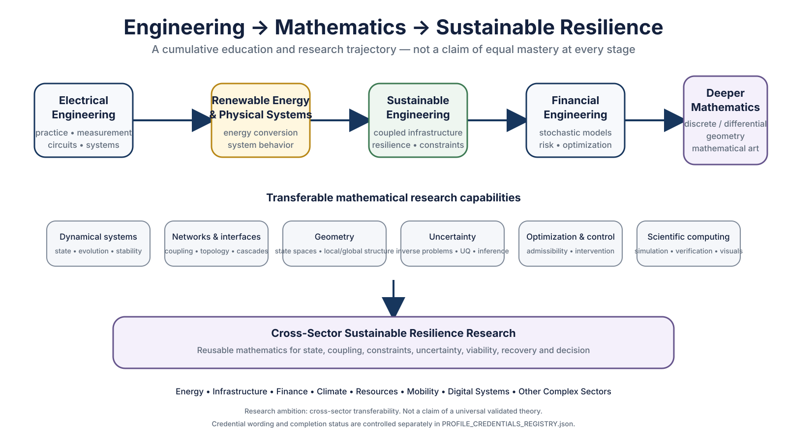
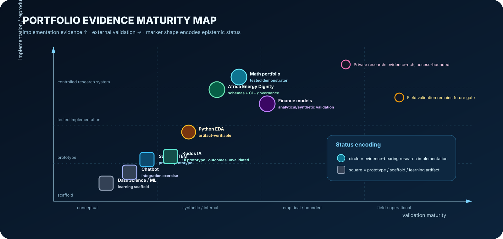
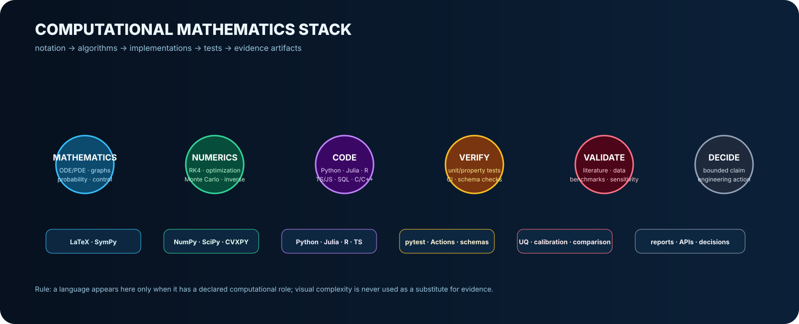

<p align="center">
  
</p>

<p align="center">
  <a href="https://dossiya-se.github.io/"></a>
  <a href="https://orcid.org/0009-0004-1071-9948"></a>
  <a href="https://www.linkedin.com/in/dossiya-dakou-/"></a>
</p>

<p align="center">
  <a href="https://github.com/Dossiya-SE/dossiya-se.github.io/actions/workflows/verify.yml"></a>
  <a href="https://github.com/Dossiya-SE/dossiya-se.github.io/actions/workflows/production-audit.yml"></a>
  <a href="https://github.com/Dossiya-SE/africa-energy-dignity/actions/workflows/python-app.yml"></a>
</p>

# Mathematical research profile

The portfolio is organized around one scientific rule:

```math
\boxed{
\text{claim strength}
\le
\text{source/evidence strength}
+\text{mathematical specification}
+\text{computational verification}
+\text{relevant validation}
}
```

A sophisticated formula, visualization, programming language, simulation, or passing test is **not** presented as stronger evidence than it actually is.

## Professional and research trajectory

<p align="center">
  
</p>

My technical path began in **practical electrical engineering** and developed through **renewable-energy and energy-systems study** into ongoing graduate work in **Sustainable Engineering** and **Financial Engineering**. Across these stages, my focus has progressively moved from physical implementation toward mathematical and computational representations of complex systems: dynamics, networks, uncertainty, optimization, viability, recovery and decision.

The forward research direction is to deepen **discrete and differential geometry, mathematical physics, dynamical systems, scientific computing and mathematical visualization**, and to investigate where these structures can rigorously support sustainable and resilient systems across sectors.

```text
Electrical engineering practice
→ renewable-energy + physical systems
→ sustainable engineering
→ financial engineering
→ deeper mathematical structures
→ cross-sector sustainable-resilience research
```

The cross-sector ambition is a **research programme**, not a claim of an already validated universal theory. The analogy with AI is limited to cross-domain reusability: the question is whether rigorously defined mathematical structures can provide transferable analytical tools while preserving domain-specific assumptions, evidence and validation requirements.

Profile wording, credential status and future public changes are governed in the **[Profile Improvement Workspace](profile-improvement/README.md)**. Exact technical-diploma and undergraduate-title reconciliation remains controlled there rather than being silently translated or renamed in this README.

## Account-wide mathematics verification

The complete 16-repository mathematics-rendering inventory, correction register,
renderer results, preserved-review decisions and limitations are published in
the **[Account-wide Mathematics-Surface Audit](docs/account-audits/MATHEMATICS_SURFACE_ACCOUNT_AUDIT_2026-08-23.md)**.

## Profile-wide mathematics universe

<p align="center">
  
</p>

The visual is a curated architecture of mathematics actually used, implemented, or explicitly specified across the profile. It is **not** a claim to contain all mathematics or to demonstrate equal mastery of every field.

The professional display contract is frozen in:

**[Mathematical Presentation Standard V3](mathematical-art/MATHEMATICAL_PRESENTATION_STANDARD.md)** · **[Adaptive Visual System V4](mathematical-art/ADAPTIVE_VISUAL_SYSTEM_V4.md)** · **[V4 Migration Closure](mathematical-art/ADAPTIVE_VISUAL_MIGRATION_CLOSURE_V4.md)** · **[Profile Formula Atlas](mathematical-art/PROFILE_FORMULA_ATLAS.md)** · **[Machine-readable Formula Registry](mathematical-art/formula_registry.json)**

---

## Mathematical research operating system

<p align="center">
  
</p>

The profile-level chain is

```math
\boxed{
\text{Evidence}
\rightarrow
\text{Definitions + Assumptions}
\rightarrow
\text{Model}
\rightarrow
\text{Computation}
\rightarrow
\text{Verification}
\rightarrow
\text{Validation}
\rightarrow
\text{Bounded Decision}
}
```

and each displayed mathematical object is assigned an evidence state:

`[S] source-grounded` · `[D] derived` · `[M] model` · `[C] computed` · `[V] verified` · `[E] empirical` · `[H] hypothesis` · `[T] target`

---

## Differential geometry: source mathematics and research transfer

<p align="center">
  
</p>

The profile now explicitly separates

```text
source differential geometry
≠ geometric metaphor
≠ formally defined infrastructure state geometry
```

The differential-geometry foundation is anchored to **Taha Sochi, _Introduction to Differential Geometry of Space Curves and Surfaces_**, registered as `SOCHI-DG-2017-UPLOADED` in the Mathematics Research Ecosystem.

Representative source mathematics includes

```math
g_{\alpha\beta}
=
\partial_\alpha\mathbf r\cdot\partial_\beta\mathbf r,
```

```math
\frac{d^2u^\alpha}{ds^2}
+
\Gamma^\alpha_{\beta\gamma}
\frac{du^\beta}{ds}
\frac{du^\gamma}{ds}=0,
```

```math
K=\frac{eg-f^2}{EG-F^2},
\qquad
\iint_S K\,d\sigma=2\pi\chi.
```

Using curvature, geodesics, or manifold language for infrastructure recovery is treated as a **research transfer requiring a formally defined state-space geometry**, not as an automatic consequence of these theorems.

---

## Formula evidence lattice

<p align="center">
  
</p>

A professional equation display carries more than TeX typography:

```text
formula ID
→ provenance
→ assumptions/domain
→ symbols/units
→ repository role
→ implementation
→ verification
→ validation
→ bounded claim
```

---

## Core mathematical objects across the profile

### Coupled infrastructure dynamics — [M]

```math
\dot x_i
=
f_i(x_i,\theta_i)
+
\sum_{j\ne i}g_{ij}(x_i,x_j,G_{ij},\theta_{ij})
+
B_i u_i
+
\xi_i.
```

### Sustainable-equitable viability — [M]

```math
K_R
=
K_{phys}\cap K_{service}\cap K_{sus}\cap K_{eq},
```

```math
\mathcal V_R
=
\left\{
x_0\in K_R:
\exists u(\cdot)\in\mathcal U,
\;X(t;x_0,u,\eta,\theta)\in K_R\;\forall t\ge0
\right\}.
```

### Inference and uncertainty — [M]

```math
y_k=h(x_k,\theta)+\varepsilon_k,
\qquad
\pi(\theta\mid y)\propto L(y\mid\theta)\pi_0(\theta).
```

### Network/interface mathematics — [S/M]

```math
L=D-A,
\qquad
G_{ij}(t)=\{\text{topology, capacity, authority, latency, state, uncertainty}\}.
```

### Reliability — [M]

```math
P_f
=
\mathbb P\!\left[g(X,H)\le0\right].
```

### Energy systems — [M]

```math
P_{gen}+P_{import}+P_{dis}
=
P_{load}+P_{loss}+P_{ch}+P_{export}.
```

### Quantitative finance — [M]

```math
\begin{aligned}
dS_t&=\mu S_t\,dt+\sqrt{v_t}S_t\,dW_t^S+\text{jump term},\\
dv_t&=\kappa(\theta-v_t)\,dt+\sigma\sqrt{v_t}dW_t^v.
\end{aligned}
```

### Machine-learning evaluation standard — [M/T]

```math
\theta^*
=
\arg\min_\theta
\sum_i\ell(f_\theta(x_i),y_i)+\lambda\Omega(\theta),
\qquad
\widehat R_{test}
=
\frac{1}{n_{test}}
\sum_i\ell(f_\theta(x_i),y_i).
```

### Measurement and transparent valuation — [M]

```math
\widehat m=m+\varepsilon_m,
\qquad
\widehat q=q+\varepsilon_q,
\qquad
\widehat V=\widehat m\,\widehat q\,P_{market}-fees.
```

The complete profile formula map is in the **[Profile Formula Atlas](mathematical-art/PROFILE_FORMULA_ATLAS.md)**.

---

## Research and engineering repositories

| Repository | Mathematical identity | Evidence boundary |
|---|---|---|
| [**Mathematical Research Portfolio**](https://github.com/Dossiya-SE/dossiya-se.github.io) | nonlinear ODEs, inverse problems, UQ, viability visualization, D3/WebGL | browser research demonstrators; not a calibrated digital twin |
| **MSE Thesis — private** | hybrid P–W–T–SW dynamics, dynamic interfaces, viability/reachability, inverse problems, UQ | active research architecture; calibration/validation remain explicit gates |
| **Infrastructure Interface Resilience Review — private** | interface topology/state/latency, cascade timing, ranking stability, evidence workflow | bounded corpus and evidence-anchored review; no global-absence claim |
| [**Africa Energy Dignity**](https://github.com/Dossiya-SE/africa-energy-dignity) | energy balance, geospatial systems, constrained multiobjective planning, resilience | pre-alpha; no production continental optimizer claim |
| **MScFE Quantitative Finance Lab — private** | SDEs, Fourier/Monte Carlo pricing, calibration, numerical/model validation | coursework/research computation; no trading-profit claim |
| [**Financial Engineering Models**](https://github.com/Dossiya-SE/dossiyadakou-mac-project) | econometrics, time series, diagnostics, model risk | simulations/diagnostics do not establish universal causal validity |
| **Responsible Gold Access Network — private** | metrology uncertainty, valuation, network flow, security/custody risk, Pareto design | evidence-informed design hypothesis; not field-validated infrastructure |
| [**Python for Rapid Engineering Solutions**](https://github.com/Dossiya-SE/Python-for-rapid-engineering-solution) | covariance, correlation, multivariate EDA | artifact-verifiable; generating source remains incomplete |
| [**Data Science & Machine Learning**](https://github.com/Dossiya-SE/Data-Science-an-Machine-Learning) | empirical risk, evaluation, calibration/UQ quality contract | learning scaffold until executable validated projects are added |
| [**Solar + STEM prototype**](https://github.com/Dossiya-SE/testasu) | PV/storage accounting + future impact-inference design | implemented UI/product prototype; impact claims require field evidence |
| **Kudos IA — private** | transparent scoring, calibration, fairness/evaluation targets | product prototype; no validated success predictor |
| [**Chatbot**](https://github.com/Dossiya-SE/chatbot) | probabilistic sequence-model explanation + API integration | integration evidence only; model internals are external |
| [**Mathematics Research Ecosystem**](https://github.com/Dossiya-SE/Dossiya-SE-Dossiya-SE) | foundations, models, examples, reproductions, visualization, computing, verification | source-grounded mathematics separated from new research hypotheses |

Repository visibility is not treated as evidence maturity.

---

## Evidence maturity — visually, not rhetorically

<p align="center">
  
</p>

**Circle = evidence-bearing research implementation. Square = prototype/scaffold.** Position is descriptive, not certification or ranking.

---

## Computational mathematics stack

<p align="center">
  
</p>

Primary roles across the profile include:

- **Python** — numerical integration, statistics, UQ, data engineering, orchestration;
- **Julia** — high-performance differential equations/manifold computation where used;
- **Wolfram Language / Mathematica + SymPy** — symbolic derivation and independent algebraic checks;
- **LaTeX + TikZ/PGFPlots + Asymptote** — publication-grade vector mathematics;
- **PyVista/VTK + Blender + WebGL/GLSL** — scientific 3-D and mathematical visualization;
- **Lean/mathlib** — formal-verification direction where theorem-level proof artifacts are appropriate;
- **R / MATLAB / C/C++ / CUDA / JavaScript/TypeScript** — repository-specific statistical, engineering, performance, and interactive roles.

The [**Polyglot Resilience Atlas**](polyglot-resilience/README.md) maps a bounded kernel across programming paradigms. Language presence is **not** used as a claim of expert proficiency.

---

## Research programmes

**Mathematical Physics of Sustainable Infrastructure Resilience** — coupled Power–Water/Drainage–Transportation–Solid-Waste systems, dynamic interfaces, inverse problems, uncertainty, sustainable-equitable viability, recovery, and constrained control/design.

**Infrastructure Interface Resilience** — cross-owner interfaces, topology uncertainty, response latency, cascading failure, recovery, evidence synthesis, and intervention ranking.

**Africa Energy Dignity** — evidence-governed energy-system planning, geospatial infrastructure, rapid deployment engineering, resilience, and energy sovereignty.

**Responsible Gold Access Network** — transparent measurement, traceability, secure custody, liquidity/finance pathways, responsible-market connection, and uncertainty-aware systems design.

**Quantitative Finance and Model Risk** — stochastic volatility, jump diffusion, rates, pricing, calibration, econometrics, diagnostics, convergence, and model-risk boundaries.

---

## Scientific integrity rules

- Simulation is never relabeled as observation.
- Association is never relabeled as causation without identification.
- A source theorem is never relabeled as an original research contribution.
- A research hypothesis is never relabeled as established mathematics.
- Passing software tests does not equal empirical validation.
- A standards reference does not imply certification.
- A programming language is not presented as mastered merely because it appears in a badge or implementation example.
- A probability requires a defined event/random object.
- An uncertainty band requires a declared construction.
- An optimization claim requires explicit objectives, constraints, variables, and admissibility conditions.
- Differential-geometric language requires a defined metric/geometric structure when used as more than visualization.

---

## Standards-aware structure

**ISO/IEC/IEEE 15288:2023** — systems life-cycle process reference.  
**MSC2020** — mathematical disciplinary taxonomy reference.  
**W3C SKOS** — knowledge-organization relations.  
**W3C PROV-O** — machine-readable provenance direction.

---

## Education

**MSE Sustainable Engineering — Arizona State University, ongoing**  
**MS Financial Engineering — WorldQuant University, ongoing**  
**Licence Professionnelle, Énergies Renouvelables et Systèmes Énergétiques — Université d’Abomey-Calavi**

Credential naming and future education-section expansion are governed by the **[Profile Credential Verification Checklist](profile-improvement/PROFILE_CREDENTIAL_VERIFICATION_CHECKLIST.md)**. The current undergraduate title is intentionally preserved until its relationship to the newer English description is reconciled from the official record.

<p align="center"><strong>Physics → Evidence → Mathematics → Computation → Verification → Validation → Decision → Resilient Service</strong></p>
