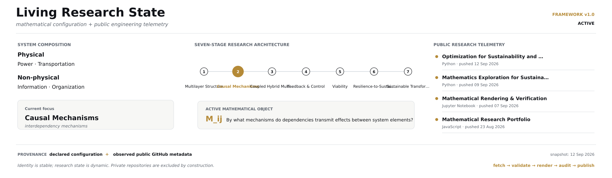

<p align="center">
  
</p>

<p align="center">
  <a href="https://dossiya-se.github.io/"></a>
  <a href="https://orcid.org/0009-0004-1071-9948"></a>
  <a href="https://www.linkedin.com/in/dossiya-dakou-/"></a>
</p>

<p align="center">
  <a href="#about">About</a> ·
  <a href="#current-research-state">State</a> ·
  <a href="#featured-research">Research</a> ·
  <a href="#research-framework">Framework</a> ·
  <a href="#mathematical-focus">Mathematics</a> ·
  <a href="#computational-toolkit">Computation</a> ·
  <a href="#research-integrity">Evidence</a>
</p>

# Dossiya Dakou

**Mathematical Sustainable Engineering for Sustainable Resilience**

Engineer and quantitative researcher developing mathematical and computational frameworks for sustainable and resilient systems.

> **Evidence invariant:** a mathematical model is not an observed mechanism; software verification is not empirical validation; a research architecture is not a universal theory.

## Current research state

<p align="center">
  
</p>

The living panel separates **declared research configuration** from **observed public repository metadata**. It is generated from versioned data, validated before publication, and excludes private repositories by construction. Repository activity is telemetry, **not evidence of scientific validity**.

## About

My trajectory connects **electrical and energy systems → sustainable engineering → quantitative modeling → advanced mathematical structures**. The current research focus is the behavior of **coupled infrastructure systems under disturbance, uncertainty, feedback, recovery and sustainability constraints**.

The central engineering question is:

> **How can the structure, dynamics and interfaces of interdependent systems be represented rigorously enough to identify failure propagation, viable operating regions and defensible interventions?**

The cross-sector direction is a research programme, **not a claim of an already validated universal theory**.

## Featured research

### Multilayer interdependent infrastructure

The present technical case centers on **power and transportation**, while explicitly separating physical, informational and organizational mechanisms when they affect system behavior.

| Layer | Engineering role | Representative objects |
|---|---|---|
| **Power** | supply, network operation and charging support | generation, substations, feeders, charging supply |
| **Transportation** | mobility and accessibility | roads, flows, EV demand, travel constraints |
| **Information** | sensing, estimation and control communication | measurements, communication links, state estimates, signals |
| **Organization** | coordination and recovery decision-making | operators, procedures, priorities, restoration actions |

A dependency is treated as a structured scientific object rather than only an edge in a graph:

```math
\boxed{
\mathfrak I_{ij}^{\alpha\beta}
=
\left(
E_i^\alpha,
E_j^\beta,
M_{ij},
w_{ij},
\delta_{ij},
\tau_{ij},
a_{ij},
m,
\mathcal H_t
\right)
}
```

The object distinguishes **source, receiver, mechanism, strength, direction, delay, operating mode and time-varying context** before the dependency is embedded in coupled dynamics.

### Active research systems

| Research system | Primary role | Maturity boundary |
|---|---|---|
| [**Mathematical Research Portfolio**](https://github.com/Dossiya-SE/dossiya-se.github.io) | nonlinear dynamics, inverse problems, uncertainty, viability and interactive mathematical visualization | research demonstrators; not a calibrated digital twin |
| [**Mathematics Exploration for Sustainable Resilience**](https://github.com/Dossiya-SE/Differential-geometry-and-Mathematics-arts-for-sustainability-and-resilience) | differential geometry, dynamical systems, resilience mathematics, reproducible computation and mathematical art | research architecture under development |
| [**Optimization for Sustainability and Resilience**](https://github.com/Dossiya-SE/Optimization-for-sustainability-and-resilience) | linear algebra, LP/MILP, network optimization and constrained sustainability/resilience models | deterministic optimization foundations |
| [**Mathematical Rendering & Verification**](https://github.com/Dossiya-SE/Math-Surface-Engineer-Demo) | renderer-aware publication and mathematical regression checking | verification demonstrator |
| [**Africa Energy Dignity**](https://github.com/Dossiya-SE/africa-energy-dignity) | energy-system modeling, geospatial engineering and constrained planning | pre-alpha research system |

## Research framework

<p align="center">
  
</p>

The current seven-stage research architecture is

```math
\boxed{
\text{Multilayer Structure}
\rightarrow
\text{Causal Mechanisms}
\rightarrow
\text{Coupled Hybrid Multiscale Dynamics}
\rightarrow
\text{Feedback \& Control}
\rightarrow
\text{Viability}
\rightarrow
\text{Resilience-to-Sustainability Interface}
\rightarrow
\text{Transformation Pathways}
}
```

A generic coupled-system representation is

```math
\dot{x}_i
=
f_i(x_i,\theta_i)
+
\sum_{j\neq i} g_{ij}(x_i,x_j,\mathfrak I_{ij},\theta_{ij})
+
B_i u_i
+
\xi_i,
```

where $x_i$ is a subsystem state, $\mathfrak I_{ij}$ is a structured interdependency, $u_i$ is an admissible intervention, $\theta$ contains model parameters, and $\xi_i$ represents disturbance or uncertainty.

The research workflow separates construction from validation:

```math
\boxed{
\text{Evidence}
\rightarrow
\text{Definitions + Assumptions}
\rightarrow
\text{Model}
\rightarrow
\text{Computation}
\rightarrow
\text{Verification}
\rightarrow
\text{Validation}
\rightarrow
\text{Decision}
}
```

## Mathematical focus

<p align="center">
  
</p>

| Mathematical area | Research role |
|---|---|
| **Dynamical systems** | state evolution, stability, disturbance propagation and recovery trajectories |
| **Optimization and control** | objectives, constraints, intervention design and feedback decisions |
| **Network science** | multilayer coupling, interface structure, propagation and structural criticality |
| **Probability and uncertainty** | stochastic disturbances, parameter uncertainty, reliability and model risk |
| **Viability / reachability** | feasible long-horizon operation under constraints and admissible control |
| **Differential geometry** | metrics, geodesics, curvature and state-space geometry when the required structure is formally defined |

For a constraint set $K$ and viable set $\mathcal V\subseteq K$, one geometric quantity of interest is

```math
\rho_g(x)=d_g\!\left(x,\partial\mathcal V\right).
```

This is first a **geometric margin**. It becomes an engineering resilience indicator only after the metric, viability boundary, physical interpretation and empirical relationship to system performance are justified.

## Computational toolkit

The research repositories separate **scientific meaning**, **typed research structure**, **presentation**, **interaction** and **numerical verification**.

```text
Markdown + LaTeX
      ↓
structured research records
      ↓
TypeScript contracts
      ↓
HTML / SVG views
      ↓
JavaScript interaction
      ↓
Python / Julia computation and verification
```

| Layer | Responsibility |
|---|---|
| **Markdown + LaTeX** | definitions, assumptions, derivations, references and equations |
| **TypeScript** | typed records for dependencies, mechanisms, evidence states and validity domains |
| **HTML** | semantic page structure and navigation |
| **CSS / SVG** | visual hierarchy, responsive presentation and mathematical graphics |
| **JavaScript** | filtering, linked diagrams, inspection and interactive research exploration |
| **Python / Julia** | simulation, optimization, inference, uncertainty analysis and reproducible numerical verification |

**GitHub README constraint:** GitHub does not execute arbitrary project JavaScript or TypeScript inside a profile README. The README therefore remains a static, auditable research surface; richer interaction belongs in the linked research portfolio.

Additional numerical and mathematical tooling includes NumPy, SciPy, MATLAB, SymPy, Geomstats, Matplotlib, PyVista/VTK, Manim, TikZ/Asymptote, D3.js and Three.js where the research question justifies them. Tool presence indicates a research role, not equal proficiency in every system.

## Education

- **MSE Sustainable Engineering — Arizona State University, ongoing**
- **MS Financial Engineering — WorldQuant University, ongoing**
- **Licence, Énergies Renouvelables et Systèmes Énergétiques — Université d’Abomey-Calavi**

The profile emphasizes a cumulative capability trajectory rather than treating education, research interests and validated expertise as equivalent claims.

## Research integrity

Mathematical models, simulations, software verification, empirical validation and engineering decisions are treated as distinct evidence levels.

| Evidence state | Meaning |
|---|---|
| **Observed / sourced** | supported by data, literature, measurements or authoritative records |
| **Modeled** | mathematically represented under explicit assumptions |
| **Computed** | produced by reproducible numerical or symbolic procedures |
| **Verified** | implementation checked against stated mathematical or software properties |
| **Validated** | compared against appropriate empirical or external evidence |
| **Decision-ready** | usable only inside a stated validity domain and uncertainty boundary |

A model is not promoted to an observed mechanism because it is mathematically elegant; passing software tests does not establish empirical validity; and geometric language is used for engineering systems only when the required structure is formally defined.

See the public [Research Integrity Standard](docs/RESEARCH_INTEGRITY.md).

## Connect

<p align="center">
  <a href="https://dossiya-se.github.io/"><strong>Research portfolio</strong></a>
  &nbsp;·&nbsp;
  <a href="https://orcid.org/0009-0004-1071-9948"><strong>ORCID</strong></a>
  &nbsp;·&nbsp;
  <a href="https://www.linkedin.com/in/dossiya-dakou-/"><strong>LinkedIn</strong></a>
</p>

<p align="center"><strong>Evidence → Mathematics → Computation → Verification → Validation → Decision</strong></p>
