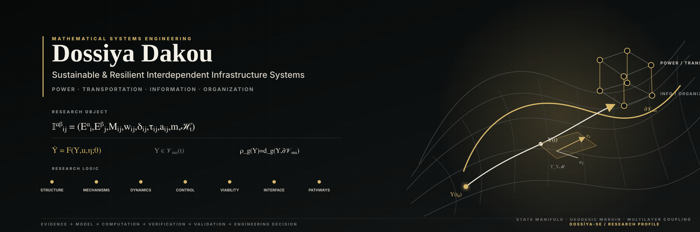
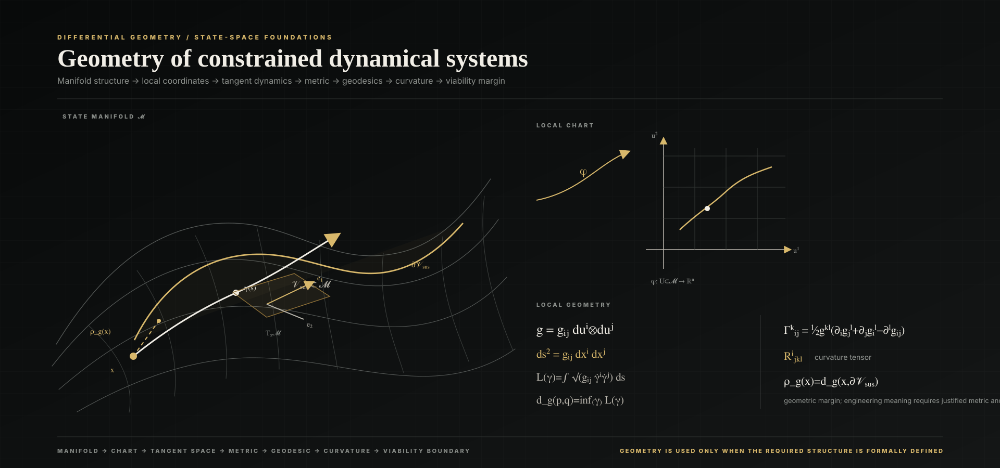

<p align="center">
  
</p>

<p align="center">
  <strong>Mathematical Systems Engineering · Sustainable Infrastructure · Resilience · Optimization · Differential Geometry</strong>
</p>

<p align="center">
  <a href="https://dossiya-se.github.io/">Research Portfolio</a>
  &nbsp;·&nbsp;
  <a href="https://orcid.org/0009-0004-1071-9948">ORCID</a>
  &nbsp;·&nbsp;
  <a href="https://www.linkedin.com/in/dossiya-dakou-/">LinkedIn</a>
</p>

---

## Research programme

I develop mathematical and computational frameworks for **interdependent infrastructure systems** operating under disturbance, uncertainty, feedback, recovery and sustainability constraints.

The present engineering focus is a minimum four-layer system:

```math
\boxed{
\text{Power}
\;\times\;
\text{Transportation}
\;\times\;
\text{Information}
\;\times\;
\text{Organization}
}
```

The central problem is not only whether infrastructures are connected, but **how dependencies transmit state, stress, delay, control, uncertainty and recovery across system boundaries**.

A dependency is therefore treated as a structured scientific object:

```math
\boxed{
\mathfrak I_{ij}^{\alpha\beta}
=
\left(
E_i^\alpha,
E_j^\beta,
M_{ij},
w_{ij},
\delta_{ij},
\tau_{ij},
a_{ij},
m,
\mathcal H_t
\right)
}
```

This separates the **source**, **receiver**, **mechanism**, **strength**, **direction**, **delay**, **operating mode**, and **time-varying context** before the dependency is embedded in coupled dynamics.

---

## Research architecture

<p align="center">
  
</p>

The governing research pathway is

```math
\boxed{
\text{Multilayer Structure}
\rightarrow
\text{Causal Mechanisms}
\rightarrow
\text{Coupled Hybrid Multiscale Dynamics}
\rightarrow
\text{Feedback \& Control}
\rightarrow
\text{Viability}
\rightarrow
\text{Resilience-to-Sustainability Interface}
\rightarrow
\text{Sustainable Transformation Pathways}
}
```

A compact coupled representation is

```math
\dot{x}_i
=
f_i(x_i,\theta_i)
+
\sum_{j\neq i}
g_{ij}(x_i,x_j,\mathfrak I_{ij},\theta_{ij})
+
B_i u_i
+
\xi_i.
```

The model is useful only when its assumptions, mechanisms, parameters, uncertainty and validity domain are explicit.

---

## Geometry of resilience and viability

<p align="center">
  
</p>

For a state manifold \(\mathcal M\), admissible set \(K\), and viable region \(\mathcal V_{\mathrm{sus}}\subseteq K\), a geometric resilience margin can be written as

```math
\boxed{
\rho_g(Y)
=
d_g\!\left(Y,\partial\mathcal V_{\mathrm{sus}}\right)
}
```

where \(d_g\) is the geodesic distance induced by a justified metric \(g\).

The quantity is first a **geometric margin**. It becomes an engineering resilience indicator only after the metric, state representation, viability boundary, physical interpretation and empirical relationship to service performance are established.

---

## Mathematical and computational foundations

| Domain | Research role |
|---|---|
| **Dynamical systems** | nonlinear state evolution, stability, cascading propagation, recovery |
| **Network science** | multilayer topology, interdependency mechanisms, structural criticality |
| **Optimization & control** | constrained intervention, feedback design, recovery and transition decisions |
| **Probability & uncertainty** | stochastic hazards, parameter uncertainty, model risk, reliability |
| **Viability & reachability** | feasible long-horizon operation under constraints and admissible control |
| **Differential geometry** | metric structure, tangent dynamics, geodesics, curvature and boundary distance |
| **Inverse problems & estimation** | inference of hidden states, mechanisms and parameters from heterogeneous observations |

The computational stack is selected by the mathematical problem rather than by software fashion:

```text
Scientific definitions + equations
            ↓
typed research objects and assumptions
            ↓
Python / Julia numerical models
            ↓
simulation · inference · optimization · uncertainty
            ↓
verification · validation · engineering interpretation
```

Representative tools include **Python, Julia, MATLAB, NumPy, SciPy, SymPy, Geomstats, Matplotlib, PyVista/VTK, Manim, TikZ/Asymptote, D3.js and Three.js** where justified by the research question.

---

## Selected research systems

| Repository | Scientific purpose |
|---|---|
| [**Mathematical Research Portfolio**](https://github.com/Dossiya-SE/dossiya-se.github.io) | interactive nonlinear dynamics, inverse problems, uncertainty, viability and mathematical visualization |
| [**Mathematics Exploration for Sustainable Resilience**](https://github.com/Dossiya-SE/Differential-geometry-and-Mathematics-arts-for-sustainability-and-resilience) | differential geometry, dynamical systems, resilience mathematics and mathematical art |
| [**Optimization for Sustainability and Resilience**](https://github.com/Dossiya-SE/Optimization-for-sustainability-and-resilience) | linear algebra, LP/MILP, network optimization and constrained engineering decisions |
| [**Mathematical Rendering & Verification**](https://github.com/Dossiya-SE/Math-Surface-Engineer-Demo) | renderer-aware mathematical publication and regression verification |
| [**Africa Energy Dignity**](https://github.com/Dossiya-SE/africa-energy-dignity) | energy-system modeling, geospatial engineering and constrained planning |

---

## Evidence discipline

```math
\boxed{
\text{Evidence}
\rightarrow
\text{Definitions + Assumptions}
\rightarrow
\text{Model}
\rightarrow
\text{Computation}
\rightarrow
\text{Verification}
\rightarrow
\text{Validation}
\rightarrow
\text{Decision}
}
```

**Observed mechanisms, mathematical models, numerical outputs, software verification and empirical validation are not treated as interchangeable evidence states.** A model is not promoted to physical truth because it is mathematically elegant, and a passing software test does not establish empirical validity.

See the public [Research Integrity Standard](docs/RESEARCH_INTEGRITY.md).

---

## Education

**MSE Sustainable Engineering** — Arizona State University, ongoing  
**MS Financial Engineering** — WorldQuant University, ongoing  
**Licence Professionnelle, Énergies Renouvelables et Systèmes Énergétiques** — Université d’Abomey-Calavi

---

<p align="center">
  <strong>Evidence → Mathematics → Computation → Verification → Validation → Engineering Decision</strong>
</p>
