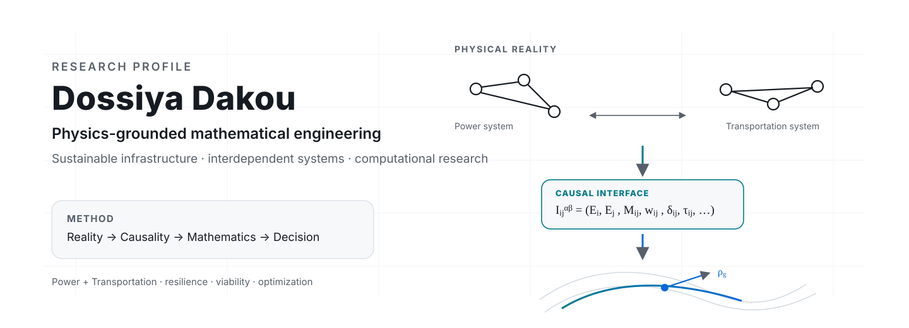
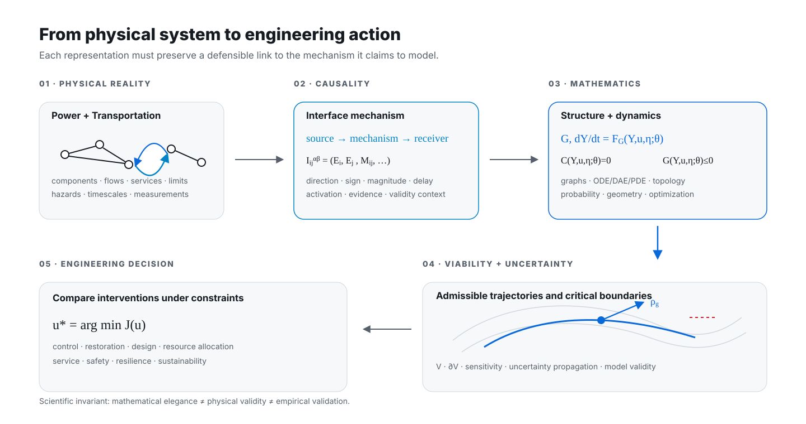

<picture>
  <source media="(prefers-color-scheme: dark)" srcset="./assets/profile/hero-dark.svg">
  <source media="(prefers-color-scheme: light)" srcset="./assets/profile/hero-light.svg">
  
</picture>

### Physics · Pure Mathematical Foundations · Sustainable Engineering · Infrastructure Systems

**Physical Reality → Causal Mechanisms → Mathematical Structure → Engineering Decision**

[Research Portfolio](https://dossiya-se.github.io/) · [LinkedIn](https://www.linkedin.com/in/dossiya-dakou-/) · [ORCID](https://orcid.org/0009-0004-1071-9948)

---

## Profile

I study engineering systems by beginning with **what physically exists, how it interacts, and what can causally change what**.  
I then use mathematics as a formal language for representation, analysis, uncertainty, computation, validation, and engineering decision-making.

My current research focuses on **interdependent power and transportation infrastructure**, with informational and organizational mechanisms included when they alter physical operation, coordination, failure propagation, or recovery.

> **Research principle:** mechanism before model · physics before abstraction · validation before strong claims.

---

## Current research

### Interdependent power–transportation systems

The core problem is to move rigorously from real infrastructure and causal dependencies to a mathematical representation that can support analysis and intervention.

\[
\boxed{
\mathcal R_{\mathrm{phys}}
\rightarrow
\mathcal C
\rightarrow
(\mathcal G,\mathfrak I)
\rightarrow
F_{\mathcal G}
\rightarrow
\mathcal V
\rightarrow
\rho_g
\rightarrow
u^\star
}
\]

where the physical interpretation of every mathematical object must be justified for the engineering system under study.

<picture>
  <source media="(prefers-color-scheme: dark)" srcset="./assets/profile/method-dark.svg">
  <source media="(prefers-color-scheme: light)" srcset="./assets/profile/method-light.svg">
  
</picture>

### What I am trying to establish

| Layer | Question | Formal object |
|---|---|---|
| **Physical reality** | What components, flows, constraints, services, hazards, and timescales actually exist? | \(\mathcal R_{\mathrm{phys}}\) |
| **Causality** | Through what mechanism does one subsystem change another? | \(\mathcal C,\ \mathfrak I_{ij}^{\alpha\beta}\) |
| **Structure** | How should physically supported dependencies be represented? | multilayer graph \(\mathcal G\) |
| **Dynamics** | How do coupled states evolve under disturbance and control? | \(\dot Y=F_{\mathcal G}(Y,u,\eta;\theta)\) |
| **Feasibility / viability** | Which trajectories remain within admissible engineering conditions? | \(K,\ \mathcal V\) |
| **Resilience geometry** | When justified, how far is the state from a critical boundary? | \(\rho_g(Y,\partial\mathcal V)\) |
| **Decision** | Which intervention improves service, safety, recovery, or sustainability? | \(u^\star\) |

---

## Research method

The method is intentionally ordered:

\[
\boxed{
\text{Physical Reality}
\rightarrow
\text{Causal Mechanisms}
\rightarrow
\text{Governing Relations}
\rightarrow
\text{Mathematical Abstraction}
\rightarrow
\text{Analysis + Computation}
\rightarrow
\text{Uncertainty + Validation}
\rightarrow
\text{Engineering Decision}
}
\]

For interdependent infrastructure, I use a dependency object richer than an edge:

\[
\mathfrak I_{ij}^{\alpha\beta}
=
\left(
E_i^\alpha,
E_j^\beta,
M_{ij},
w_{ij},
\delta_{ij},
\tau_{ij},
a_{ij},
m,
\mathcal H_t
\right).
\]

This forces the model to distinguish **source, receiver, mechanism, magnitude, direction/sign, delay, activation, evidence status, and validity context** rather than treating interdependence as a purely graphical connection.

<b>Scientific and engineering standard</b>

A mathematical analogy is not automatically a physical model. A defensible engineering model should state, where applicable:

- system boundary, state variables, parameters, units, initial/boundary conditions;
- conservation, constitutive, operational, safety, and capacity relations;
- causal assumptions, delays, feedback, activation conditions, and timescales;
- numerical method, convergence/verification checks, and limiting cases;
- measurement, parameter, structural, scenario, and numerical uncertainty;
- validation evidence, validity domain, limitations, and decision relevance.

I keep the following distinctions explicit:

\[
\text{mathematical consistency}
\neq
\text{physical plausibility}
\neq
\text{numerical verification}
\neq
\text{empirical validation}
\neq
\text{engineering usefulness}.
\]

---

## Mathematical foundations

I use pure mathematical structures when they reveal engineering structure that is otherwise difficult to see directly.

| Mathematical area | Engineering role |
|---|---|
| **Differential geometry** | constrained state spaces, metrics, geodesic structure, boundary distance |
| **Graph theory & topology** | multilayer structure, connectivity, interfaces, propagation pathways |
| **Analysis & differential equations** | state evolution, bounds, stability, coupled continuous dynamics |
| **Dynamical systems** | equilibria, regime transitions, recovery trajectories, multiscale behavior |
| **Probability & stochastic processes** | hazards, measurement uncertainty, parameter uncertainty, reliability |
| **Optimization & control** | intervention, restoration, design, constrained resource allocation |

---

## Selected research & engineering work

### 01 / Mathematics for Sustainable Resilience
**Differential geometry · dynamical systems · resilience mathematics**

Formal and computational exploration of mathematical structures relevant to sustainability and resilience, with physical interpretation kept separate from formal mathematical validity.

[Open repository →](https://github.com/Dossiya-SE/Differential-geometry-and-Mathematics-arts-for-sustainability-and-resilience)

### 02 / Optimization for Sustainability and Resilience
**Linear algebra · LP/MILP · network optimization · constrained decisions**

Optimization foundations for engineering problems in which variables, objectives, constraints, feasibility, and interpretation must be explicit.

[Open repository →](https://github.com/Dossiya-SE/Optimization-for-sustainability-and-resilience)

### 03 / Africa Energy Dignity
**Energy systems · geospatial engineering · infrastructure planning**

Engineering research on energy access and infrastructure planning with emphasis on physical constraints, spatial reasoning, transparent assumptions, and reproducible computation.

[Open repository →](https://github.com/Dossiya-SE/africa-energy-dignity)

### 04 / Python for Rapid Engineering Solutions
**Scientific computing · numerical analysis · reproducible engineering workflows**

Computational engineering work focused on turning physical questions into auditable numerical procedures rather than isolated scripts.

[Open repository →](https://github.com/Dossiya-SE/Python-for-rapid-engineering-solution)

### 05 / Mathematical Research Portfolio
**Interactive research communication · mathematical demonstrations**

A public surface for mathematical and computational demonstrations that require richer interaction than a GitHub README.

[Open portfolio →](https://dossiya-se.github.io/) · [Repository →](https://github.com/Dossiya-SE/dossiya-se.github.io)

---

## Research experience

**National University of Singapore** — Visiting Graduate Researcher, 2026  
Infrastructure-system interfaces and resilience: representing, measuring, and connecting cross-infrastructure dependencies to failure and recovery behavior.

---

## Education

| Institution | Program |
|---|---|
| **Arizona State University** | MSE · Sustainable Engineering · Ongoing |
| **WorldQuant University** | MSc · Financial Engineering · Ongoing |
| **Université d’Abomey-Calavi** | Licence · Énergies Renouvelables et Systèmes Énergétiques |

---

## Capabilities

**Physical-system reasoning** · **Causal mechanism modeling** · **Mathematical abstraction** · **Coupled dynamical systems** · **Optimization & control** · **Scientific computing** · **Uncertainty reasoning** · **Verification & validation**

**Scientific computing:** Python · NumPy · SciPy · SymPy · pandas · NetworkX · Matplotlib  
**Numerical / optimization work:** mathematical programming · numerical linear algebra · Julia / MATLAB where appropriate  
**Research communication:** LaTeX · Overleaf · TikZ · Markdown  
**Engineering workflow:** Git · GitHub Actions · reproducible computational pipelines

---

## Research interests

**Physics-grounded mathematical engineering** · Pure mathematical structures for engineering applications  
Differential geometry · Graph theory · Topology · Dynamical systems · Analysis · Optimization · Uncertainty  
Complex systems · Sustainable infrastructure · Infrastructure resilience

---

**Observe the physical system. Identify the mechanism. Formalize mathematically. Compute. Validate. Intervene.**

[Research Portfolio](https://dossiya-se.github.io/) · [LinkedIn](https://www.linkedin.com/in/dossiya-dakou-/) · [ORCID](https://orcid.org/0009-0004-1071-9948)

