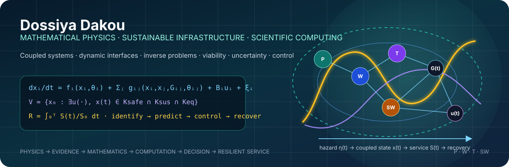

  

<h1 align="center">Dossiya Dakou</h1>

<strong>Sustainable Engineering · Mathematical Physics · Infrastructure Resilience · Energy Systems · Scientific Computing</strong>

  
  
  
  

## Research identity

I work at the intersection of **sustainable infrastructure, mathematical physics, energy systems, resilience engineering, uncertainty, optimization, financial engineering and scientific computing**. My central research question is how coupled infrastructure can remain physically feasible, socially equitable and operationally recoverable under climate and system stress.

My work emphasizes **mechanistic models before black-box prediction**, **interfaces before isolated assets**, and **service continuity before component-level performance**.

### Core mathematical object

For a coupled infrastructure state \(x(t)\), dynamic interfaces \(G(t)\), controls \(u(t)\), hazards \(\eta(t)\), and uncertain parameters \(\theta\):

$$
\dot{x}_i=f_i(x_i,\theta_i)+\sum_j g_{ij}(x_i,x_j,G_{ij},\theta_{ij})+B_i u_i+\xi_i,
$$

with safe-sustainable viability defined conceptually by

$$
\mathcal{V}_{\mathrm{sus,eq}}=\left\{x_0:\exists u(\cdot)\;\text{s.t.}\;x(t)\in\mathcal{K}_{\mathrm{safe}}\cap\mathcal{K}_{\mathrm{sustainable}}\cap\mathcal{K}_{\mathrm{equitable}},\;\forall t\in[0,T]\right\}.
$$

The engineering objective is not only to predict failure, but to identify **which interfaces, controls and recovery actions keep critical services inside this viable region**.

## Mathematical systems architecture

| Chain | Scientific question | Representative mathematics |
|---|---|---|
| **I. Physics → Structure → Interfaces → Dynamics** | What laws govern the coupled system and how do dependencies propagate? | Conservation laws, PDEs/ODEs, graph theory, multilayer networks, nonlinear dynamics |
| **II. Observe → Identify → Estimate → Predict** | What can be inferred from incomplete, noisy observations? | Inverse problems, Bayesian inference, filtering, data assimilation, system identification |
| **III. Hazard → Failure → Service Loss → Consequences** | How does stress become loss of critical service? | Reliability, fragility, stochastic processes, percolation, threshold models |
| **IV. Recovery → Resilience → Viability** | Can the system recover while respecting safe and sustainable bounds? | Recovery dynamics, viability theory, reachability, resilience functionals |
| **V. Decision → Control → Optimization** | Which actions preserve service at minimum social and physical cost? | Optimal control, convex/nonconvex optimization, MPC, stochastic/robust optimization |
| **VI. Equity → Population → Critical-Service Continuity** | Who receives service, when, and under what constraints? | Spatial allocation, welfare functions, equity constraints, multi-objective optimization |

## Current research and engineering portfolio

| Project | Role of mathematics and computation |
|---|---|
| **Mathematical Physics of Sustainable Infrastructure Resilience** | Coupled power–water–transport–solid-waste dynamics, dynamic interfaces, inverse problems, viability, uncertainty and control |
| **Infrastructure Interface Resilience Review** | Interface taxonomy, evidence synthesis, coding, quantitative screening and recovery-oriented gap analysis |
| **Africa Energy Dignity** | African energy evidence governance, geospatial analysis, energy-system optimization and rapid-deployment engineering |
| **Responsible Gold Access Network (RGAN)** | Secure physical/digital architecture, traceability, metrology, finance, energy autonomy and system-of-systems design |
| **Quantitative Finance Laboratory** | Monte Carlo methods, stochastic processes, risk, time series and numerical finance |

## Computational language atlas

I do **not** present a long badge wall as proof of mastery. Languages are organized by their scientific role and by actual development intent.

### Primary scientific workflow

  
  
  
  

### Numerical, statistical and optimization languages

  
  
  
  
  

### High-performance and systems implementations

  
  
  
  
  

### Scientific interfaces, visualization and deployment

  
  
  
  
  
  
  
  

The [polyglot resilience atlas](polyglot-resilience/README.md) defines how the same infrastructure-resilience kernel maps across major computational paradigms. This is an interoperability roadmap, **not a claim of expert proficiency in every language**.

## Scientific-computing stack

**Numerics:** NumPy · SciPy · pandas · SymPy · Matplotlib  
**Optimization:** CVXPY · Pyomo · mathematical programming workflows  
**Statistics / ML:** statsmodels · scikit-learn · SPSS · Minitab  
**Research:** Jupyter · Git · GitHub · Zotero · LaTeX  
**Engineering:** energy-system modeling · digital twins · HSPICE · OpenLCA · reproducible simulation pipelines

## Reproducibility contract

Every serious computational project should expose, where applicable:

1. **governing equations and assumptions**;
2. **data provenance and units**;
3. **parameter definitions and uncertainty**;
4. **deterministic baseline tests**;
5. **Monte Carlo / sensitivity analysis**;
6. **machine-readable outputs**;
7. **figures generated from code**;
8. **environment or dependency specification**;
9. **validation against literature, measurements or benchmark cases**; and
10. **clear separation between observed evidence, inferred quantities and proposed models**.

## Selected repositories

| Repository | Focus |
|---|---|
| [MSE-thesis](https://github.com/Dossiya-SE/MSE-thesis) | Mathematical physics of sustainable infrastructure resilience |
| [responsible-gold-access-network-rgan](https://github.com/Dossiya-SE/responsible-gold-access-network-rgan) | Responsible gold access, physical/digital systems and secure formalization infrastructure |
| [africa-energy-dignity](https://github.com/Dossiya-SE/africa-energy-dignity) | African energy sovereignty, evidence, optimization and deployment engineering |
| [Python-for-rapid-engineering-solution](https://github.com/Dossiya-SE/Python-for-rapid-engineering-solution) | Numerical methods, simulation and rapid engineering computation |
| [Data-Science-an-Machine-Learning](https://github.com/Dossiya-SE/Data-Science-an-Machine-Learning) | Statistical learning and applied analytics |
| [dossiyadakou-mac-project](https://github.com/Dossiya-SE/dossiyadakou-mac-project) | Quantitative finance and stochastic modeling |

## Education and current study

- **Master of Science in Engineering — Sustainable Engineering**, Arizona State University — ongoing
- **Master of Science — Financial Engineering**, WorldQuant University — ongoing
- **Licence Professionnelle — Énergies Renouvelables et Systèmes Énergétiques**, Université d’Abomey-Calavi

## GitHub snapshot

  
  

## Mathematical art

The visual language of this profile is generated from the same ideas used in the research: **state spaces, coupled graphs, invariant regions, trajectories, uncertainty envelopes and recovery geometry**. See [mathematical-art/README.md](mathematical-art/README.md).

---

<strong>Physics → Evidence → Mathematics → Computation → Decision → Resilient Service</strong>

