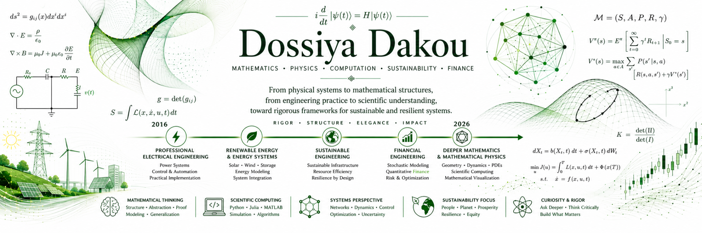
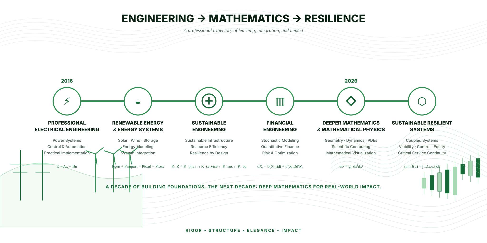
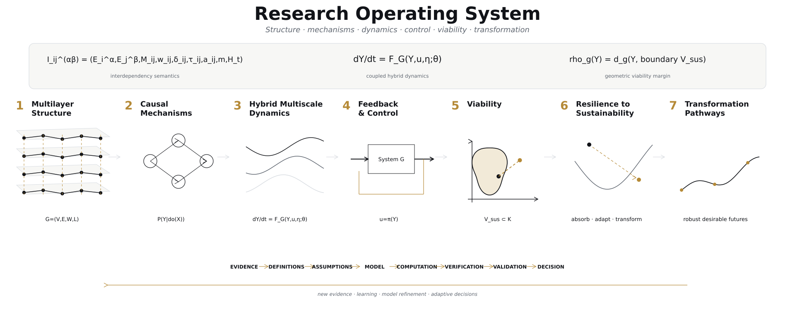
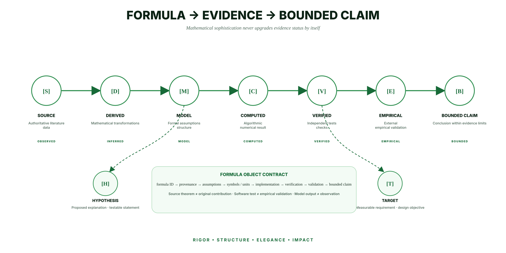

<p align="center">
  
</p>

<p align="center">
  <a href="https://dossiya-se.github.io/"></a>
  <a href="https://orcid.org/0009-0004-1071-9948"></a>
  <a href="https://www.linkedin.com/in/dossiya-dakou-/"></a>
</p>

<p align="center">
  <a href="#professional-and-research-trajectory">Trajectory</a> ·
  <a href="#research-programmes">Research programmes</a> ·
  <a href="#mathematics-as-a-research-operating-system">Mathematics</a> ·
  <a href="#optimization-uncertainty-and-bounded-decision">Decision science</a> ·
  <a href="#scientific-computing-and-mathematical-art">Scientific computing</a> ·
  <a href="#evidence-and-validation">Evidence</a> ·
  <a href="#research-and-engineering-repositories">Repositories</a> ·
  <a href="#education">Education</a>
</p>

# Mathematical research profile

My work connects **engineering practice, energy and infrastructure systems, quantitative finance, mathematical physics, scientific computing and sustainable resilience**. The common objective is to formulate complex systems through explicit state, dynamics, coupling, uncertainty, constraints, viability, recovery and decision structures rather than relying on visual or verbal analogy alone.

The portfolio is governed by a non-compensatory evidence invariant:

```math
\boxed{
L(C)
\le
\min_{k\in\mathcal R(C)} L_k
}
```

Here `L(C)` is the maturity permitted for a public claim and `\mathcal R(C)` is the set of support dimensions required by that claim. **A claim cannot exceed its weakest required support dimension.** Mathematical sophistication, computational verification, visual quality or software breadth cannot compensate for missing empirical evidence, missing assumptions, or an unvalidated model when those are required.

## Professional and research trajectory

<p align="center">
  
</p>

My technical path began in **practical electrical engineering** and developed through **renewable-energy and energy-systems study** into ongoing graduate work in **Sustainable Engineering** and **Financial Engineering**. Across these stages, the emphasis has moved progressively from physical implementation toward mathematical and computational representations of complex systems: dynamics, networks, uncertainty, optimization, viability, recovery and decision.

The forward research direction is to deepen **discrete and differential geometry, mathematical physics, dynamical systems, scientific computing and mathematical visualization**, and to investigate where these structures can rigorously support sustainable and resilient systems across sectors. The cross-sector ambition is a **research programme**, not a claim of an already validated universal theory.

Profile wording, credential status and future public changes are governed in the **[Profile Improvement Workspace](profile-improvement/README.md)**. Exact technical-diploma and undergraduate-title reconciliation remains controlled there rather than being silently translated or renamed in this README.

---

## Research programmes

| Programme | Mathematical / engineering focus | Current evidence boundary |
|---|---|---|
| **Mathematical Physics of Sustainable Infrastructure Resilience** | coupled Power–Water/Drainage–Transportation–Solid-Waste systems, dynamic interfaces, inverse problems, uncertainty, viability, recovery, constrained control/design | active research architecture; calibration and validation remain explicit gates |
| **Infrastructure Interface Resilience** | interface topology/state/latency, cascade timing, recovery, evidence synthesis, intervention ranking | bounded evidence corpus; no global-absence claim |
| [**Africa Energy Dignity**](https://github.com/Dossiya-SE/africa-energy-dignity) | energy balance, geospatial systems, constrained multi-objective planning, resilience | pre-alpha research system; no production continental optimizer claim |
| **Responsible Gold Access Network** | metrology uncertainty, transparent valuation, network flow, security/custody risk, Pareto design | evidence-informed design hypothesis; not field-validated infrastructure |
| **Quantitative Finance and Model Risk** | stochastic volatility, jump diffusion, rates, Markov/HMM models, pricing, calibration, econometrics, backtesting, numerical/model validation | coursework/research computation; no trading-profit or universal superiority claim |

---

## Mathematics as a research operating system

<p align="center">
  
</p>

The mathematics universe is a curated architecture of mathematics **actually used, implemented, or explicitly specified** across the profile. It is not a claim to contain all mathematics or to demonstrate equal mastery of every field.

The professional display contract is governed by the **[Mathematical Presentation Standard V3](mathematical-art/MATHEMATICAL_PRESENTATION_STANDARD.md)**, **[Adaptive Visual System V4](mathematical-art/ADAPTIVE_VISUAL_SYSTEM_V4.md)**, **[Profile Rendering Architecture V6](mathematical-art/PROFILE_RENDERING_ARCHITECTURE_V6.md)**, **[Professional Decision Architecture V1](docs/knowledge-graphs/PRO_PROFILE_DECISION_ARCHITECTURE_V1.md)**, **[Profile Formula Atlas](mathematical-art/PROFILE_FORMULA_ATLAS.md)** and **[Machine-readable Formula Registry](mathematical-art/formula_registry.json)**. The V6 renderer registry assigns each public visual its own motion, interaction and verification boundary rather than treating animation as a universal improvement.

### From evidence to bounded decision

<p align="center">
  
</p>

The profile-level chain is

```math
\boxed{
\text{Evidence}
\rightarrow
\text{Definitions + Assumptions}
\rightarrow
\text{Model}
\rightarrow
\text{Computation}
\rightarrow
\text{Verification}
\rightarrow
\text{Validation}
\rightarrow
\text{Bounded Decision}
}
```

Displayed mathematical objects use the evidence states `[S] source-grounded`, `[D] derived`, `[M] model`, `[C] computed`, `[V] verified`, `[E] empirical`, `[H] hypothesis`, and `[T] target`.

---

## Optimization, uncertainty and bounded decision

<p align="center">
  
</p>

The decision-science layer now separates two complementary mathematical rails instead of treating all optimization as one generic node.

**Deterministic operations research** follows **problem/data → variables, objective and constraints → feasible geometry/conservation → optimization → primal-dual or KKT certificate → sensitivity/post-optimal analysis**. The source inventory covers linear programming, convexity, basic feasible solutions, simplex structure, duality, sensitivity, integer relaxation/branch-and-bound, network flow and nonlinear constrained optimization.

**Bayesian sequential optimization** follows **observations → probabilistic surrogate/posterior uncertainty → acquisition rule → new evaluation → update**. It is used as a distinct uncertainty-aware decision mechanism rather than as a replacement for deterministic optimization.

The **[Optimization and Decision Verification Lab](optimization-lab/README.md)** provides executable benchmark certificates for LP primal/dual feasibility and complementary slackness, min-cost-flow conservation and bounds, an equality-constrained convex-QP KKT system, and compact EI/UCB regression semantics. The **[IEE 574 + Bayesian Knowledge Graph](docs/knowledge-graphs/IEE574_BAYESIAN_KNOWLEDGE_GRAPH_V1.md)** controls prerequisite/dependency structure, while **[OR Source Anchors V1](docs/knowledge-graphs/OR_SOURCE_ANCHORS_V1.md)** records the exact instructional slide/page anchors used for deterministic-OR promotion.

Course-derived mathematics is presented as **source-grounded instructional mathematics `[S]`**, not as original research. A verified optimization benchmark establishes a mathematical certificate for that benchmark; it does **not** by itself validate an infrastructure, finance, or other real-world decision model.

---

## Differential geometry and mathematical art

<p align="center">
  
</p>

The profile explicitly separates **source differential geometry**, **geometric visualization**, and **formally defined state-space geometry**. The differential-geometry foundation is anchored to Taha Sochi, _Introduction to Differential Geometry of Space Curves and Surfaces_, registered as `SOCHI-DG-2017-UPLOADED` in the Mathematics Research Ecosystem.

Using curvature, geodesics, or manifold language for infrastructure recovery is treated as a **research transfer requiring a formally defined state-space geometry**—metric, differentiability, distance, curvature meaning, estimator and validation must be declared rather than inferred from visual resemblance.

The **[Verified Geometry Engine V6](mathematical-art/geometry-engine/README.md)** now provides an executable reference geometry layer: parameterized surface, coordinate tangents, unit normal, first fundamental form, Gaussian curvature, renderer-neutral exchange, regression tests and a fail-closed verification gate. Its reference torus is a computational differential-geometry demonstrator only; it does not promote application state spaces to manifolds by analogy.

---

## Scientific computing and mathematical art

<p align="center">
  
</p>

Primary roles across the profile include **Python/NumPy/SciPy** for numerical integration, statistics, UQ, optimization, geometry and orchestration; **SciPy/HiGHS** for compact LP/network-flow verification benchmarks; **SymPy/Mathematica/SageMath** for symbolic work; **Geomstats** for explicit manifold algorithms where a manifold is actually defined; **Julia/MATLAB/C++/Rust/CUDA** where numerical or performance roles are justified; **Lean/mathlib/Coq** for formal-verification directions; **Matplotlib/PyVista/VTK** for scientific rendering; **Manim** for mathematical motion; **Blender/Geometry Nodes** for cinematic rendering downstream of verified data; **Three.js/WebGPU/WebGL/D3** for interactive browser mathematics; and **LaTeX/TikZ/Asymptote/SVG** for vector publication surfaces.

The renderer architecture follows one rule: **compute and verify first; render second**. A renderer may change camera, typography, tessellation density, lighting or interaction, but it may not silently change the underlying equations, topology, field values, evidence state or scientific interpretation. Per-visual policies are machine-readable in the **[V6 Renderer Registry](mathematical-art/geometry-engine/renderer_registry_v6.json)**.

The [**Polyglot Resilience Atlas**](polyglot-resilience/README.md) maps a bounded kernel across programming paradigms. Language presence is **not** used as a claim of expert proficiency.

---

## Evidence and validation

<p align="center">
  
</p>

A professional mathematical object carries more than typography: provenance, assumptions, symbols/units, repository role, implementation, verification, validation and the bounded claim must remain distinguishable.

<p align="center">
  <a href="https://github.com/Dossiya-SE/Dossiya-SE/actions/workflows/verified-geometry-audit.yml"></a>
  <a href="https://github.com/Dossiya-SE/Dossiya-SE/actions/workflows/optimization-decision-audit.yml"></a>
  <a href="https://github.com/Dossiya-SE/dossiya-se.github.io/actions/workflows/verify.yml"></a>
  <a href="https://github.com/Dossiya-SE/dossiya-se.github.io/actions/workflows/production-audit.yml"></a>
  <a href="https://github.com/Dossiya-SE/africa-energy-dignity/actions/workflows/python-app.yml"></a>
</p>

The complete 16-repository mathematics-rendering inventory, correction register, renderer results, preserved-review decisions and limitations are published in the **[Account-wide Mathematics-Surface Audit](docs/account-audits/MATHEMATICS_SURFACE_ACCOUNT_AUDIT_2026-08-23.md)**.

<details>
<summary><strong>Repository evidence-maturity map</strong></summary>

<p align="center">
  
</p>

**Circle = evidence-bearing research implementation. Square = prototype/scaffold.** Position is descriptive, qualitative, and not certification, ranking, or a numeric research-quality score. V6 explicitly prohibits temporal animation of this map unless longitudinal evidence is introduced; motion cannot manufacture a time dimension that the evidence does not contain.

</details>

---

## Research and engineering repositories

### Selected laboratories and research systems

| Repository | Role | Evidence boundary |
|---|---|---|
| [**Mathematical Research Portfolio**](https://github.com/Dossiya-SE/dossiya-se.github.io) | nonlinear ODEs, inverse problems, UQ, viability visualization, D3/WebGL | browser research demonstrators; not a calibrated digital twin |
| **MSE Thesis — private** | hybrid P–W–T–SW dynamics, interfaces, viability/reachability, inverse problems, UQ | active research architecture; calibration/validation remain explicit gates |
| **Infrastructure Interface Resilience Review — private** | interface topology/state/latency, cascade timing, evidence workflow | bounded corpus and evidence-anchored review |
| [**Africa Energy Dignity**](https://github.com/Dossiya-SE/africa-energy-dignity) | energy planning, constrained optimization, geospatial infrastructure, resilience | pre-alpha research system |
| **MScFE Quantitative Finance Lab — private** | SDEs, stochastic modeling, pricing, econometrics, calibration, model validation | coursework/research computation; no trading-profit claim |
| **Responsible Gold Access Network — private** | metrology, valuation, traceability, network flow, custody/security risk | evidence-informed design hypothesis; field validation remains a gate |
| [**Mathematics Research Ecosystem**](https://github.com/Dossiya-SE/Dossiya-SE-Dossiya-SE) | foundations, source reproductions, models, visualization, computing, verification | source-grounded mathematics separated from new research hypotheses |

<details>
<summary><strong>Full repository matrix</strong></summary>

| Repository | Mathematical identity | Evidence boundary |
|---|---|---|
| [**Mathematical Research Portfolio**](https://github.com/Dossiya-SE/dossiya-se.github.io) | nonlinear ODEs, inverse problems, UQ, viability visualization, D3/WebGL | browser research demonstrators; not a calibrated digital twin |
| **MSE Thesis — private** | hybrid P–W–T–SW dynamics, dynamic interfaces, viability/reachability, inverse problems, UQ | active research architecture; calibration/validation remain explicit gates |
| **Infrastructure Interface Resilience Review — private** | interface topology/state/latency, cascade timing, ranking stability, evidence workflow | bounded corpus and evidence-anchored review; no global-absence claim |
| [**Africa Energy Dignity**](https://github.com/Dossiya-SE/africa-energy-dignity) | energy balance, geospatial systems, constrained multiobjective planning, resilience | pre-alpha; no production continental optimizer claim |
| **MScFE Quantitative Finance Lab — private** | SDEs, Fourier/Monte Carlo pricing, calibration, numerical/model validation | coursework/research computation; no trading-profit claim |
| [**Financial Engineering Models**](https://github.com/Dossiya-SE/dossiyadakou-mac-project) | econometrics, time series, diagnostics, model risk | simulations/diagnostics do not establish universal causal validity |
| **Responsible Gold Access Network — private** | metrology uncertainty, valuation, network flow, security/custody risk, Pareto design | evidence-informed design hypothesis; not field-validated infrastructure |
| [**Python for Rapid Engineering Solutions**](https://github.com/Dossiya-SE/Python-for-rapid-engineering-solution) | covariance, correlation, multivariate EDA | artifact-verifiable; generating source remains incomplete |
| [**Data Science & Machine Learning**](https://github.com/Dossiya-SE/Data-Science-an-Machine-Learning) | empirical risk, evaluation, calibration/UQ quality contract | learning scaffold until executable validated projects are added |
| [**Solar + STEM prototype**](https://github.com/Dossiya-SE/testasu) | PV/storage accounting + future impact-inference design | implemented UI/product prototype; impact claims require field evidence |
| **Kudos IA — private** | transparent scoring, calibration, fairness/evaluation targets | product prototype; no validated success predictor |
| [**Chatbot**](https://github.com/Dossiya-SE/chatbot) | probabilistic sequence-model explanation + API integration | integration evidence only; model internals are external |
| [**Mathematics Research Ecosystem**](https://github.com/Dossiya-SE/Dossiya-SE-Dossiya-SE) | foundations, models, examples, reproductions, visualization, computing, verification | source-grounded mathematics separated from new research hypotheses |

Repository visibility is not treated as evidence maturity.

</details>

---

<details>
<summary><strong>Core mathematical objects across the profile</strong></summary>

### Coupled infrastructure dynamics — [M]

```math
\dot x_i
=
f_i(x_i,\theta_i)
+
\sum_{j\ne i}g_{ij}(x_i,x_j,G_{ij},\theta_{ij})
+
B_i u_i
+
\xi_i.
```

### Sustainable-equitable viability — [M]

```math
K_R
=
K_{phys}\cap K_{service}\cap K_{sus}\cap K_{eq},
```

```math
\mathcal V_R
=
\left\{
x_0\in K_R:
\exists u(\cdot)\in\mathcal U,
\;X(t;x_0,u,\eta,\theta)\in K_R\;\forall t\ge0
\right\}.
```

### Inference and uncertainty — [M]

```math
y_k=h(x_k,\theta)+\varepsilon_k,
\qquad
\pi(\theta\mid y)\propto L(y\mid\theta)\pi_0(\theta).
```
### Network/interface mathematics — [S/M]

```math
L=D-A,
\qquad
G_{ij}(t)=\{\text{topology, capacity, authority, latency, state, uncertainty}\}.
```

### Reliability — [M]

```math
P_f
=
\mathbb P\!\left[g(X,H)\le0\right].
```

### Energy systems — [M]

```math
P_{gen}+P_{import}+P_{dis}
=
P_{load}+P_{loss}+P_{ch}+P_{export}.
```

### Quantitative finance — [M]

```math
\begin{aligned}
dS_t&=\mu S_t\,dt+\sqrt{v_t}S_t\,dW_t^S+\text{jump term},\\
dv_t&=\kappa(\theta-v_t)\,dt+\sigma\sqrt{v_t}dW_t^v.
\end{aligned}
```

### Machine-learning evaluation standard — [M/T]

```math
\theta^*
=
\arg\min_\theta
\sum_i\ell(f_\theta(x_i),y_i)+\lambda\Omega(\theta),
\qquad
\widehat R_{test}
=
\frac{1}{n_{test}}
\sum_i\ell(f_\theta(x_i),y_i).
```

### Measurement and transparent valuation — [M]

```math
\widehat m=m+\varepsilon_m,
\qquad
\widehat q=q+\varepsilon_q,
\qquad
\widehat V=\widehat m\,\widehat q\,P_{market}-fees.
```

The complete profile formula map is maintained in the **[Profile Formula Atlas](mathematical-art/PROFILE_FORMULA_ATLAS.md)**.

</details>

<details>
<summary><strong>Scientific integrity and standards</strong></summary>

### Scientific integrity rules

- Simulation is never relabeled as observation.
- Association is never relabeled as causation without identification.
- A source theorem is never relabeled as an original research contribution.
- A research hypothesis is never relabeled as established mathematics.
- Passing software tests does not equal empirical validation.
- A standards reference does not imply certification.
- A programming language is not presented as mastered merely because it appears in a badge or implementation example.
- A probability requires a defined event/random object.
- An uncertainty band requires a declared construction.
- An optimization claim requires explicit objectives, constraints, variables, and admissibility conditions.
- An optimization solver result is not presented as a validated real-world decision without model/data validation and, where available, mathematical optimality checks.
- Differential-geometric language requires a defined metric/geometric structure when used as more than visualization.

### Standards-aware structure

**ISO/IEC/IEEE 15288:2023** — systems life-cycle process reference.  
**MSC2020** — mathematical disciplinary taxonomy reference.  
**W3C SKOS** — knowledge-organization relations.  
**W3C PROV-O** — machine-readable provenance direction.

</details>

---

## Education

**MSE Sustainable Engineering — Arizona State University, ongoing**  
**MS Financial Engineering — WorldQuant University, ongoing**  
**Licence Professionnelle, Énergies Renouvelables et Systèmes Énergétiques — Université d’Abomey-Calavi**

Credential naming and future education-section expansion are governed by the **[Profile Credential Verification Checklist](profile-improvement/PROFILE_CREDENTIAL_VERIFICATION_CHECKLIST.md)**. The current undergraduate title is intentionally preserved until its relationship to the newer English description is reconciled from the official record.

<p align="center"><strong>Physics → Evidence → Mathematics → Computation → Verification → Validation → Decision → Resilient Service</strong></p>