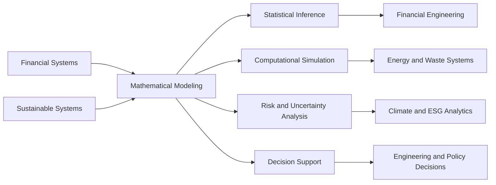
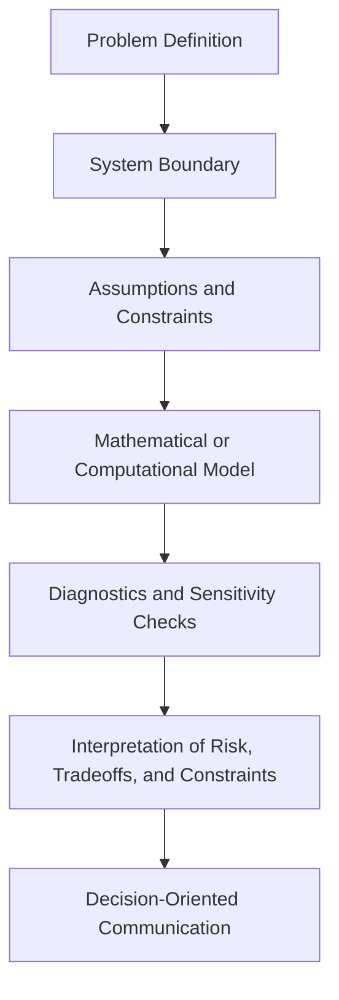

<!--
Profile README for Dossiya Dakou
GitHub: https://github.com/Dossiya-SE
-->

<p align="center">
  
</p>

<p align="center">
  <a href="https://github.com/Dossiya-SE">
    
  </a>
  <a href="https://www.linkedin.com/in/dossiya-dakou-/">
    
  </a>
  
</p>

<p align="center">
  
</p>

---

# Dossiya Dakou

I am a graduate researcher and engineering practitioner working at the intersection of **financial engineering**, **sustainable systems engineering**, and **computational decision science**.

My work focuses on building mathematical and computational frameworks for complex systems shaped by **uncertainty**, **constraints**, **feedback**, **externalities**, and **tradeoffs**. I apply statistical reasoning, numerical methods, systems thinking, and reproducible computation to problems in financial markets, environmental impact assessment, energy systems, waste systems, and sustainability decision support.

---

## Academic Profile

### Current Graduate Training

- **MSc in Financial Engineering** — WorldQuant University  
- **Master of Science in Engineering, Sustainable Engineering** — Arizona State University  

### Academic Background

- **Bachelor of Physics in Renewable Energy and Energy Systems**
- **Diploma in Electrical Engineering**

---

## Research Identity

My technical identity is built around one central question:

> How can mathematical and computational models make complex systems more measurable, interpretable, and decision-relevant?

I work across two connected domains:



Financial systems and sustainable systems may appear different, but they share deep modeling challenges: uncertainty, incomplete information, feedback, dynamic behavior, constraints, and tradeoffs across time and scale.

---

## Portfolio Architecture

My GitHub is organized into two professional research portfolios.

<table>
  <tr>
    <td width="50%" valign="top">
      <h3>Financial Engineering Portfolio</h3>
      <p>
        Quantitative finance, time-series modeling, risk analysis, model selection,
        computational finance, and data-driven financial research.
      </p>
      <a href="https://github.com/Dossiya-SE/dossiyadakou-mac-project">
        
      </a>
    </td>
    <td width="50%" valign="top">
      <h3>Sustainable Engineering Portfolio</h3>
      <p>
        Life Cycle Assessment, energy systems, waste systems, environmental impact
        modeling, circular economy analysis, and sustainability decision support.
      </p>
      <a href="https://github.com/Dossiya-SE/testasu">
        
      </a>
    </td>
  </tr>
</table>

---

# I. Financial Engineering Portfolio

This portfolio develops quantitative methods for financial systems, with emphasis on stochastic behavior, time-series structure, statistical modeling, risk, and computational finance.

## Core Research Areas

- Financial time-series analysis  
- Stationarity, unit-root testing, and persistence  
- Econometric modeling and diagnostics  
- Statistical model selection and validation  
- Risk modeling and uncertainty quantification  
- Monte Carlo simulation  
- Numerical and computational finance  
- Python-based quantitative research workflows  

## Representative Work

| Repository | Research / Engineering Focus |
|---|---|
| [Financial Engineering Models](https://github.com/Dossiya-SE/dossiyadakou-mac-project) | Quantitative finance problems, modeling workflows, reports, figures, and analytical interpretation |
| [Data Science and Machine Learning](https://github.com/Dossiya-SE/Data-Science-an-Machine-Learning) | Statistical learning, supervised modeling, diagnostics, and applied analytics |

## Research Direction

This track supports work in:

```text
Quantitative Finance
├── Financial engineering
├── Time-series and econometric modeling
├── Risk and uncertainty quantification
├── Computational finance
├── Data-driven financial research
└── Climate finance and ESG analytics
```

---

# II. Sustainable Engineering Portfolio

This portfolio applies systems engineering, Life Cycle Assessment, and environmental analytics to sustainability challenges across energy, waste, resources, and climate systems.

## Core Research Areas

- Life Cycle Assessment  
- Functional units, reference flows, and system boundaries  
- Environmental inventory modeling  
- Energy systems analysis  
- Waste and circular economy modeling  
- Climate and emissions assessment  
- Sustainability decision support  
- Burden shifting, uncertainty, and tradeoff interpretation  

## Representative Work

| Repository | Research / Engineering Focus |
|---|---|
| [Python for Rapid Engineering Solutions](https://github.com/Dossiya-SE/Python-for-rapid-engineering-solution) | Numerical methods, engineering computation, simulation, and Python-based modeling |
| [Sustainable Engineering / ASU Work](https://github.com/Dossiya-SE/testasu) | Sustainable engineering workflows, systems analysis, and applied software experimentation |

## Research Direction

This track supports work in:

```text
Sustainable Systems Engineering
├── Life Cycle Assessment
├── Energy systems modeling
├── Waste systems analysis
├── Environmental impact assessment
├── Climate-tech modeling
└── Systems-based sustainability assessment
```

---

## Mathematical and Computational Toolkit

<p align="center">
  
  
  
  
  
  
</p>

<p align="center">
  
  
  
  
  
</p>

### Mathematical and Statistical Modeling

- Dynamical systems  
- Numerical methods  
- Statistical modeling  
- Time-series analysis  
- Optimization logic  
- Uncertainty analysis  
- Sensitivity analysis  
- Model diagnostics  

### Financial Engineering Methods

- Econometric modeling  
- Stationarity analysis  
- Risk modeling  
- Model selection  
- Quantitative research methods  
- Computational finance  

### Sustainable Engineering Methods

- Life Cycle Assessment  
- Energy systems modeling  
- Waste systems analysis  
- Environmental impact assessment  
- Systems thinking  
- Sustainability analytics  

---

## Engineering Method

My work follows a structured modeling sequence.



This method allows me to move across domains while maintaining the same technical standard: clear assumptions, reproducible workflows, rigorous modeling, and useful interpretation.

---

## Research Operating Logic

```python
class ResearchWorkflow:
    def __init__(self, system):
        self.system = system
        self.assumptions = []
        self.constraints = []
        self.uncertainties = []
        self.outputs = {}

    def define_problem(self):
        return "Translate a complex system into a measurable decision problem."

    def model_system(self):
        return "Use mathematics, data, and computation to represent system behavior."

    def validate(self):
        return "Test assumptions, inspect diagnostics, and evaluate sensitivity."

    def interpret(self):
        return "Explain risk, tradeoffs, limitations, and decision implications."


financial_systems = ResearchWorkflow("financial markets")
sustainable_systems = ResearchWorkflow("energy, waste, and environmental systems")
```

---

## Selected Project Themes

<table>
  <tr>
    <td width="33%" valign="top">
      <h3>Quantitative Finance</h3>
      <ul>
        <li>Time-series modeling</li>
        <li>Risk and uncertainty</li>
        <li>Model selection</li>
        <li>Econometric diagnostics</li>
        <li>Financial data analysis</li>
      </ul>
    </td>
    <td width="33%" valign="top">
      <h3>Sustainable Engineering</h3>
      <ul>
        <li>Life Cycle Assessment</li>
        <li>Energy systems</li>
        <li>Waste systems</li>
        <li>Environmental impact modeling</li>
        <li>Sustainability decision support</li>
      </ul>
    </td>
    <td width="33%" valign="top">
      <h3>Computational Engineering</h3>
      <ul>
        <li>Python workflows</li>
        <li>Numerical methods</li>
        <li>Simulation</li>
        <li>Data visualization</li>
        <li>Reproducible analysis</li>
      </ul>
    </td>
  </tr>
</table>

---

## Current Research Direction

<details>
<summary><strong>Quantitative Finance and Risk Modeling</strong></summary>

This track focuses on the mathematical and computational analysis of financial systems.

Areas of emphasis include:

- Financial engineering  
- Quantitative analysis  
- Risk and uncertainty modeling  
- Time-series and econometric methods  
- Computational finance  
- Data-driven financial research  
- Climate finance and ESG analytics  

</details>

<details>
<summary><strong>Sustainable Systems and Environmental Modeling</strong></summary>

This track focuses on the modeling of environmental, resource, energy, and waste systems.

Areas of emphasis include:

- Sustainable engineering  
- Life Cycle Assessment  
- Energy systems  
- Waste systems  
- Environmental analytics  
- Circular economy modeling  
- Climate-tech and systems-based sustainability assessment  

</details>

---

## GitHub Research Snapshot

<p align="center">
  
  
</p>

---

## Broader Research Vision

Financial markets, energy transitions, waste systems, and environmental impacts may appear separate, but they share common modeling challenges:

- Uncertainty  
- Feedback  
- Dynamic behavior  
- Incomplete information  
- Externalities  
- Constraints  
- Tradeoffs across time and scale  

My portfolio is built around that shared structure. I am interested in mathematical and computational tools that help decision-makers understand complex systems with greater clarity, discipline, and accountability.

---

## Connect

<p align="center">
  <a href="https://github.com/Dossiya-SE">
    
  </a>
  <a href="https://www.linkedin.com/in/dossiya-dakou-/">
    
  </a>
</p>

---

<p align="center">
  <strong>Mathematical modeling for financial, environmental, and engineering decision systems.</strong>
</p>

<p align="center">
  <em>Building research portfolios in quantitative finance, sustainable systems engineering, and computational decision science.</em>
</p>
