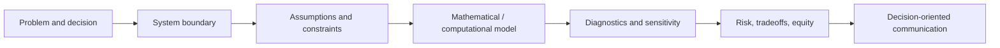

<!--
  Profile README — Dossiya Dakou (@Dossiya-SE)
  Energy systems · physics · sustainable finance · mathematical modeling
-->

  

  
  
  
  

  

---

I use mathematics and physics to make infrastructure and finance decisions **computable** — optimization and network equilibrium, power-systems physics, and stochastic risk, applied to systems shaped by uncertainty, feedback, and tradeoffs. My work runs the full path **from the physics of an energy system to the capital that builds it**, and keeps equity and the full life-cycle burden inside the model rather than in a footnote.

  
  
  
  

<strong>📍 Singapore / Arizona</strong> &nbsp;·&nbsp; 🌐 <a href="https://dossiya-se.github.io">dossiya-se.github.io</a>

---

## Selected work

> Each link goes live when its repository is published. Nothing here points to an empty repo.

### 🔌 Coupled Energy–Transport Networks &nbsp;·&nbsp; *MSc thesis (in progress)*

Electric vehicles couple two infrastructures the literature models apart: **roads**, where drivers route selfishly, and the **distribution grid**, governed by power-flow physics. I model the roads as a Wardrop user equilibrium through the **Beckmann** convex reformulation, price uncoordinated charging with the **price of anarchy**, and represent the grid with the **LinDistFlow** relaxation of the AC branch-flow equations on the IEEE 33-bus feeder — making the coupling geometric, with consequences for efficiency and for an equity frontier the scalar view can't see.

### ☀️ School-Anchored Solar Mini-Grid &nbsp;·&nbsp; *design & bankability model*

A **31.1 kWp** PV system sized from **IEC 61724-1** and tested against two independent finance criteria: LCOE passes, but year-three **DSCR fails at 0.81** — a failure that reporting LCOE alone conceals. A **10,000-draw Monte Carlo** under correlated adverse scenarios places it on the bankability boundary; avoided carbon is bounded across CDM and Gold Standard methodologies rather than collapsed to a single number.

### 📊 AI Use & First-Year Engineering Performance &nbsp;·&nbsp; *empirical study, n = 460*

A validated **33-item** instrument across seven constructs, analyzed with ANOVA, multiple regression, and **latent profile analysis** — a finite-mixture model that recovers unobserved sub-populations rather than assuming one. Cross-sectional, so the findings are associational, and stated as such.

---

## Portfolio tracks

<table>
  <tr>
    <td width="50%" valign="top">
      <h3>📈 Financial Engineering</h3>
      

        Quantitative finance, time-series structure, stationarity &amp; unit-root testing,
        risk and uncertainty quantification, Monte Carlo, and computational finance.
      

      
    </td>
    <td width="50%" valign="top">
      <h3>🌍 Sustainable Engineering</h3>
      

        Life-cycle assessment, energy &amp; waste systems, environmental inventory modeling,
        carbon-market accounting, and sustainability decision support.
      

      
    </td>
  </tr>
</table>

---

## What I work with

**Mathematics** — convex optimization &amp; network equilibrium (Beckmann, Wardrop, price of anarchy); convex relaxations of power flow (branch-flow / LinDistFlow); Monte Carlo &amp; uncertainty quantification; applied statistics.

**Physics** — power flow on radial networks, energy balance, photovoltaic system behavior, IEC performance standards.

**Sustainable finance &amp; LCA** — LCOE, WACC across a multi-source capital stack, DSCR / LLCR, viability-gap restructuring, and carbon-market accounting (CDM, Gold Standard); life-cycle assessment in **OpenLCA** with **ecoinvent**, per ISO 14040 / 44.

**Statistics &amp; data** — ANOVA, correlation, multiple regression, latent profile analysis — in **SPSS**, **Minitab**, and Python (pandas · statsmodels · scikit-learn).

**Scientific computing** — Python (NumPy · SciPy · CVXPY · Matplotlib), LaTeX, Git. Used to solve, not to demo.

  
  
  
  
  
  
  
   
  
  
  
  
  

---

## How I model a system

---

## GitHub snapshot

  
  

---

  Across all of it: the full life-cycle burden kept in view, and access treated as a <strong>modeled variable</strong> — not a footnote.

  <a href="https://www.linkedin.com/in/dossiya-dakou-/">LinkedIn</a>
  &nbsp;·&nbsp; Singapore / Arizona
  &nbsp;·&nbsp; <a href="mailto:ddakou@asu.edu">ddakou@asu.edu</a>

