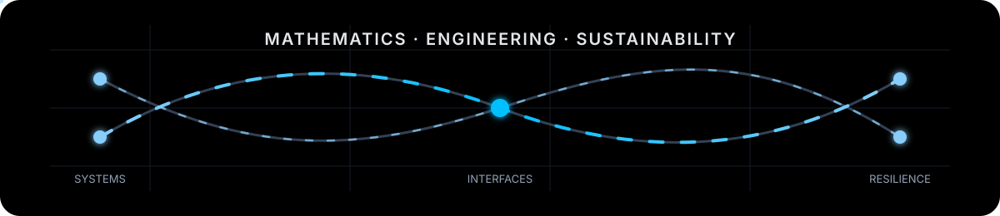

# Dossiya Dakou

**Sustainable Engineering · Applied Mathematics · Complex Infrastructure Systems**

Graduate researcher studying how mathematical and computational methods can improve the **sustainability, resilience, and recovery of interconnected infrastructure systems**.

**Research:** Differential Geometry · Dynamical Systems · Graph-Based Modeling · Viability Theory · Power–Transportation Systems

**Current:** MSE Sustainable Engineering, Arizona State University · Visiting Graduate Researcher, National University of Singapore

[Research Portfolio](https://dossiya-se.github.io/) · [Research Laboratory](https://dossiya-se.github.io/lab.html) · [Repositories](https://github.com/Dossiya-SE?tab=repositories) · [ORCID](https://orcid.org/0009-0004-1071-9948) · [LinkedIn](https://www.linkedin.com/in/dossiya-dakou-/)

