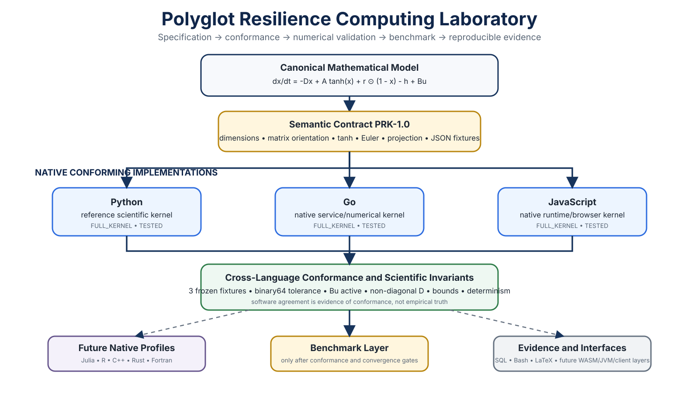

# Polyglot Resilience Atlas

[](https://github.com/Dossiya-SE/Dossiya-SE/actions/workflows/polyglot-resilience-conformance.yml)



**One scientific model. Multiple computing ecosystems. One explicit semantic contract.**

The purpose of this atlas is not to reproduce similar syntax in many programming languages. It is to test whether a formally specified resilience model can retain its **mathematical semantics, numerical behavior, provenance, and scientific interpretation** across heterogeneous computing ecosystems.

> This atlas is **not a claim of expert proficiency in every language**. Every language is assigned an explicit role, implementation profile, maturity state, and conformance status. A language is not called validated until it passes the same frozen scientific fixtures as the reference implementation.

## Scientific objective

The project separates six claims that are often conflated:

```text
mathematical specification
        ↓
software implementation
        ↓
cross-language numerical agreement
        ↓
time-discretization convergence
        ↓
physical / resilience plausibility
        ↓
empirical validity
```

Agreement across languages establishes **software/numerical conformance**, not empirical truth.

## Three model levels

### Level A — continuous-time scientific model

Let \(x(t)\in[0,1]^n\) denote normalized infrastructure-service states. The baseline continuous-time model is

$$
\dot{x}(t)
=
-Dx(t)
+A\phi(x(t))
+r\odot(1-x(t))
-h(t)
+Bu(t),
$$

with baseline nonlinearity

$$
\phi(x)_i=\tanh(x_i).
$$

### Level B — canonical discrete kernel `PRK-1.0`

The reference numerical step uses explicit Euler followed by projection:

$$
\tilde{x}_{t+1}
=
x_t+\Delta t\,f(x_t,h_t,u_t),
$$

$$
\boxed{
 x_{t+1}=\Pi_{[0,1]^n}(\tilde{x}_{t+1})
},
$$

where

$$
f(x,h,u)=-Dx+A\tanh(x)+r\odot(1-x)-h+Bu.
$$

The projection is componentwise clipping to \([0,1]\).

### Level C — implementation profiles

| Profile | Meaning |
|---|---|
| `FULL_KERNEL` | Implements the complete `PRK-1.0` kernel, including full \(D\), \(A\), recovery, hazard, \(Bu\), nonlinearity and projection |
| `DIAGONAL_D_KERNEL` | Research variant with \(D=\operatorname{diag}(d)\); not automatically equivalent to `FULL_KERNEL` |
| `BINDING` | Language interface to a separately validated compiled kernel |
| `SERVICE_WRAPPER` | Orchestration/service layer; does not independently establish kernel correctness |
| `VISUALIZATION_CLIENT` | Consumes validated results; does not solve the scientific model |
| `ADAPTER` | Persistence, specification or workflow integration rather than numerical solving |

The formal definitions are frozen in [`KERNEL_SPECIFICATION.md`](KERNEL_SPECIFICATION.md) and [`SEMANTIC_CONTRACT.md`](SEMANTIC_CONTRACT.md).

## Current conformance status

The authoritative status is machine-readable in [`registry/implementation-registry.json`](registry/implementation-registry.json).

| Language / layer | Intended role | Profile | Current evidence state |
|---|---|---|---|
| **Python** | reference scientific implementation | `FULL_KERNEL` | **VALIDATED — GitHub CI conformance PASS** |
| **Go** | service / concurrent numerical implementation | `FULL_KERNEL` | **VALIDATED — GitHub CI conformance PASS** |
| **JavaScript** | browser/runtime native implementation | `FULL_KERNEL` | **VALIDATED — GitHub CI conformance PASS** |
| Julia | scientific numerics / differential equations | `FULL_KERNEL` target | planned conformance implementation |
| R | statistical uncertainty workflows | `FULL_KERNEL` target | planned conformance implementation |
| C++ | HPC kernel | `FULL_KERNEL` target | planned conformance implementation |
| Rust | memory-safe HPC / WASM candidate | `FULL_KERNEL` target | planned conformance implementation |
| Fortran | scientific/HPC interoperability | `FULL_KERNEL` target | planned conformance implementation |
| Java / Kotlin / Scala | JVM services and pipelines | service or native target | planned |
| TypeScript | typed scientific interface | client / native target | planned |
| Swift | native field interface | client / native target | planned |
| Haskell | functional/formal experimentation | research profile | planned |
| Wolfram Language | symbolic/exploratory mathematics | symbolic adapter | planned |
| SQL | evidence/state persistence | `ADAPTER` | specified separately from numerical solvers |
| Bash | reproducible orchestration | `ADAPTER` | specified separately from numerical solvers |
| LaTeX | canonical mathematical communication | `ADAPTER` | specified separately from numerical solvers |

### Independent validation evidence

GitHub Actions run `32620003277` independently passed:

- Python, Go and Node runtime setup;
- static syntax checks;
- structural and semantic-contract validation;
- the reference scientific invariant suite;
- **9 frozen conformance checks** = 3 native implementations × 3 scientific fixtures.

The pre-CI local runs and independent CI runs both observed no numerical disagreement for the frozen fixture outputs at the declared tolerance. The run identity is also recorded in the implementation registry.

No row is promoted merely because source code exists. The maturity ladder is:

```text
PLANNED → LEARNING → IMPLEMENTED → TESTED → VALIDATED → BENCHMARKED
```

## Frozen scientific fixtures

Three canonical fixtures exercise different model terms:

- [`baseline.json`](fixtures/baseline.json) — non-zero degradation, coupling, recovery, hazard and control;
- [`controlled-recovery.json`](fixtures/controlled-recovery.json) — stronger recovery and control;
- [`severe-hazard.json`](fixtures/severe-hazard.json) — materially stronger hazard forcing.

The reference outputs are frozen in [`expected-results.json`](fixtures/expected-results.json).

For implementation \(\ell\), one-step conformance requires

$$
\left\|x_{t+1}^{(\ell)}-x_{t+1}^{(\mathrm{ref})}\right\|_\infty\le\varepsilon,
$$

with the baseline tolerance set by the validation standard rather than chosen after seeing results.

## Scientific invariant gates

Every conforming kernel must satisfy at least:

1. **dimension integrity** — matrix/vector dimensions agree with \(n\) and \(m\);
2. **finite-input integrity** — all numerical inputs are finite;
3. **state admissibility** — input and projected output states are in \([0,1]^n\);
4. **recovery admissibility** — \(r_i\ge0\);
5. **weight admissibility** — \(w_i\ge0\) and \(\sum_iw_i=1\);
6. **determinism** — identical deterministic inputs produce identical outputs;
7. **cross-language agreement** — frozen fixtures agree within tolerance;
8. **directional plausibility tests** — controlled fixture changes are checked for the intended qualitative response where the model assumptions justify monotonicity.

See [`VALIDATION_STANDARD.md`](VALIDATION_STANDARD.md).

## Resilience metrics

The baseline weighted-service statistic is

$$
R_{\mathrm{AUC}}
=
\frac{1}{T}\sum_{t=1}^{T}w^\top x_t,
\qquad
w_i\ge0,
\quad
\sum_iw_i=1.
$$

It is deliberately **not treated as a complete definition of resilience**. The research roadmap extends the metric into a vector such as

$$
\mathcal R=
\left(
R_{\mathrm{AUC}},
R_{\min},
T_{\mathrm{recovery}},
P[\text{violation}],
R_{\mathrm{critical\ service}}
\right),
$$

because equal average service can hide materially different minima, recovery times, threshold violations and equity/critical-service outcomes.

## Architecture

```text
                    CANONICAL MATHEMATICAL MODEL
                              │
                    SEMANTIC CONTRACT PRK-1.0
                              │
             ┌────────────────┼────────────────┐
             ▼                ▼                ▼
          Python             Go          JavaScript
        reference          native           native
             │                │                │
             └────────────────┼────────────────┘
                              ▼
                    CONFORMANCE TESTS
                              │
                  frozen fixtures + tolerance
                              │
               ┌──────────────┴──────────────┐
               ▼                             ▼
        numerical validation            future bindings
               │                             │
        convergence / HPC                WASM / JVM / R
               │                             │
               └──────────────┬──────────────┘
                              ▼
                      evidence + provenance
```

The editable vector version is [`architecture/polyglot-resilience-architecture.svg`](architecture/polyglot-resilience-architecture.svg).

## Repository structure

```text
polyglot-resilience/
├── README.md
├── KERNEL_SPECIFICATION.md
├── SEMANTIC_CONTRACT.md
├── MODEL_ASSUMPTIONS.md
├── VALIDATION_STANDARD.md
├── BENCHMARK_PROTOCOL.md
├── architecture/
├── schemas/
├── fixtures/
├── implementations/
│   ├── python/
│   ├── go/
│   └── javascript/
├── adapters/
├── registry/
├── tests/
└── tools/
```

SQL, Bash and LaTeX are intentionally treated as adapters/specification layers rather than falsely presented as equivalent numerical solvers.

## Reference implementation

```bash
python polyglot-resilience/implementations/python/kernel.py \
  polyglot-resilience/fixtures/baseline.json
```

Run structural and scientific checks with:

```bash
python polyglot-resilience/tools/validate_structure.py
python polyglot-resilience/tests/invariants/test_reference_kernel.py
python polyglot-resilience/tests/conformance/compare_outputs.py
```

## Benchmarking rule

Performance is measured **only after correctness and conformance pass**:

```text
scientific specification
        ↓
implementation correctness
        ↓
cross-language conformance
        ↓
numerical convergence
        ↓
benchmarking
```

Benchmark dimensions include runtime, throughput, memory, initialization cost and scaling with state dimension \(n\) and horizon \(T\). No language is called faster on the basis of an unvalidated implementation. See [`BENCHMARK_PROTOCOL.md`](BENCHMARK_PROTOCOL.md).

## Reproducibility and provenance

A validated run should record at minimum:

```text
SPEC_VERSION
IMPLEMENTATION_ID
IMPLEMENTATION_VERSION
LANGUAGE_VERSION
COMPILER / RUNTIME
COMPILER_FLAGS where applicable
INPUT_SHA256
OUTPUT_SHA256
GIT_COMMIT
PLATFORM
TOLERANCE_PROFILE
```

The goal is to distinguish **same scientific experiment** from merely **similar source code**.

## Scientific limitations

- `PRK-1.0` is a research kernel, not an empirically validated universal infrastructure law.
- Projection to \([0,1]^n\) enforces service bounds numerically; it does not itself prove physical realism.
- Explicit Euler introduces discretization error and requires convergence/stability analysis.
- Cross-language agreement can reveal implementation inconsistency but cannot prove the scientific model is correct.
- Monotonicity tests are valid only under clearly stated assumptions; nonlinear interdependency can invalidate naive directional expectations.
- The scalar weighted-service score is incomplete for resilience, equity and critical-service analysis.

## Expansion rule

A new language is added only when it contributes a distinct scientific, numerical, interoperability, deployment or formal-method capability **and** has a declared profile and evidence state. The objective is coverage with meaning, not artificial badge count.
